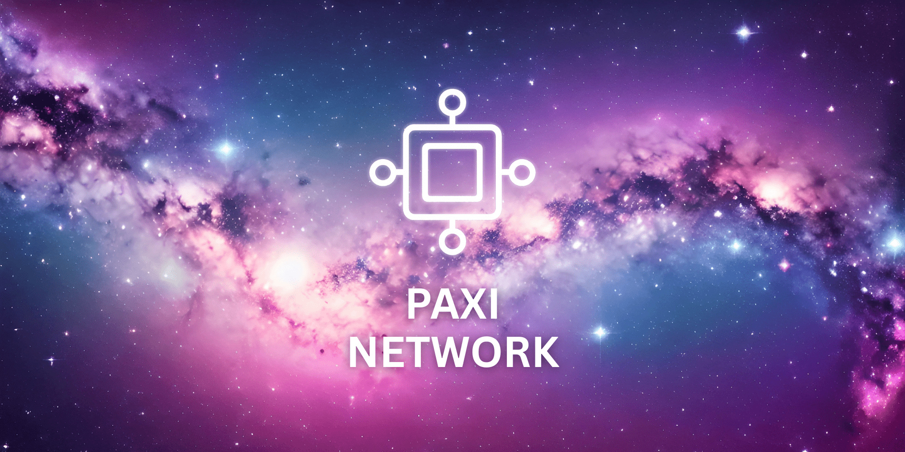

## 🌌 Paxi Blockchain
[](LICENSE)
[](https://goreportcard.com/report/github.com/paxi-web3/paxi)
[](https://github.com/paxi-web3/paxi/releases/tag/v1.0.1)
[](https://github.com/cosmos/cosmos-sdk/releases/tag/v0.53.0-rc.4)
[](https://github.com/cometbft/cometbft/releases/tag/v0.38.17)
[](https://github.com/CosmWasm/wasmd/releases/tag/v0.55.0)




**Paxi** is a next-generation blockchain built for simplicity, speed, and radical decentralization.

Founded on the principle that *less is more*, Paxi is designed to strip away unnecessary complexity and deliver a clean, efficient, and developer-friendly experience. Every part of the system is purpose-driven — from its modular [Cosmos SDK](https://docs.cosmos.network/v0.53/learn/intro/overview) architecture to its blazing-fast [CometBFT](https://docs.cometbft.com/v0.38/) consensus engine — enabling a blockchain network that is both powerful and beautifully minimal. 

Paxi also supports **smart contracts** via [CosmWasm](https://docs.cosmwasm.com) — a secure and powerful smart contract platform based on WebAssembly (Wasm). Contracts are written in **Rust**, giving developers strong type safety, high performance, and access to a rich ecosystem of tooling.

**Built upon deep optimizations of the Cosmos SDK and CometBFT**, Paxi achieves enhanced performance and security, making it an ideal foundation for scalable and resilient blockchain applications.

**Paxi lowers the barrier to participation**, allowing anyone to become a validator — not just those with deep pockets. This ensures a more inclusive and decentralized network, where governance and consensus are open to all.

Powered by **Go**, Paxi delivers high performance, fast development cycles, and easy onboarding for technical contributors. Whether you're building DeFi protocols, Web3 apps, or next-gen games, Paxi gives you a solid, secure, and intuitive platform to build on.

> **Paxi is not trying to do everything — just everything that matters.**

---

### Core Values

- **Minimal but complete** system architecture — no bloat, just the essentials
- **Fast** – Optimized consensus and state execution, supporting >1,000 TPS
- **Secure** – Proven Tendermint-based BFT consensus with enhanced validator safety
- **Simple is beautiful** – Intuitive module system, CLI & GUI interfaces, developer-friendly SDK
- **Developer-first** — with future IDE and low-code support

### Key Features

- **Smart Contract Support** – Deploy custom logic using Wasm (or native modules)
- **Open Participation** – Anyone can run a node, low entry barrier for validators
- **On-chain Governance & DAO Ready** – Built-in support for decentralized proposals, voting, and community coordination
- **Truly Decentralized** – Designed to maximize validator distribution and community sovereignty
- **Ideal for DeFi & GameFi** – High performance and developer freedom make Paxi a perfect foundation for next-gen apps

Paxi is not just a Cosmos-based chain — it's an **evolution** of the Cosmos model, bringing deeper performance optimizations and a smoother path to sovereignty for any project.

## Documentation

- [Cosmos SDK Documentation](https://docs.cosmos.network/v0.53/learn/intro/overview)
- [CometBFT Documentation](https://docs.cometbft.com/v0.38/)
- [CosmWasm Documentation](https://cosmwasm.cosmos.network/)


## Structure
```mermaid
graph TD
  A[Paxi Blockchain] --> B[Cosmos SDK]
  A --> C[CometBFT]
  A --> D[CosmWasm]
  A --> E[Paxi Custom Modules]
  ```


## Quick Start for Developers

### 1. Install Dependencies

```bash
# Install dependencies
sudo apt-get update && apt-get install -y \
    build-essential git cmake \
    libsnappy-dev zlib1g-dev libbz2-dev \
    liblz4-dev libzstd-dev wget curl pkg-config \
    ca-certificates 

# Install Go
export GOLANG_VERSION=1.24.2
curl -LO https://go.dev/dl/go${GOLANG_VERSION}.linux-amd64.tar.gz && \
  tar -C /usr/local -xzf go${GOLANG_VERSION}.linux-amd64.tar.gz && \
  ln -s /usr/local/go/bin/go /usr/bin/go
    
# In order to speed up Paxi node, we use rocksdb instead of goleveldb
# First of all you need to build rocksdb before going to the next step
git clone https://github.com/facebook/rocksdb.git && cd rocksdb
git checkout v9.2.1 # or the version you want

# Compile and install to /usr/local
make -j$(nproc) shared_lib
sudo make install-shared INSTALL_PATH=/usr/local

# Add /usr/local/lib to the dynamic linker search paths
echo "/usr/local/lib" | sudo tee /etc/ld.so.conf.d/rocksdb.conf
sudo ldconfig && cd ..
```

### 2. Clone & Build Paxi

```bash
# Build Paxid
git clone https://github.com/paxi-web3/paxi && cd paxi
make install
```

### 3. Start the Test Node

```bash
# Initialize the node configuration (set your node name and chain ID)
paxid init your_node_name --chain-id my-testnet
# Create a new account (make sure to save your mnemonic safely)
paxid keys add your_account_name
# Allocate 1,000,000 PAXI tokens to your account in the genesis file
paxid genesis add-genesis-account your_account_name 1000000000000upaxi
# Generate a genesis transaction by staking 900,000 PAXI
paxid genesis gentx your_account_name 900000000000upaxi
# Aggregate all genesis transactions into the genesis file
paxid genesis collect-gentxs
# Start the blockchain node
paxid start
```

## Launch Your Own PAXI Mainnet Node in Minutes

### 🐧 Linux Native Install
```bash
curl -sL https://raw.githubusercontent.com/paxi-web3/paxi/install.sh | bash
```

### 🐳 Docker Install
```bash
curl -sL https://raw.githubusercontent.com/paxi-web3/paxi/docker_install.sh | bash
```

## Whitepaper

- [English Whitepaper ](docs/whitepaper.md)
- [中文白皮書 ](docs/whitepaper_zh.md)


## Official Website

👉 [https://x.com/paxiweb3](https://x.com/paxiweb3)

## License

MIT © 2025 Paxi Team

