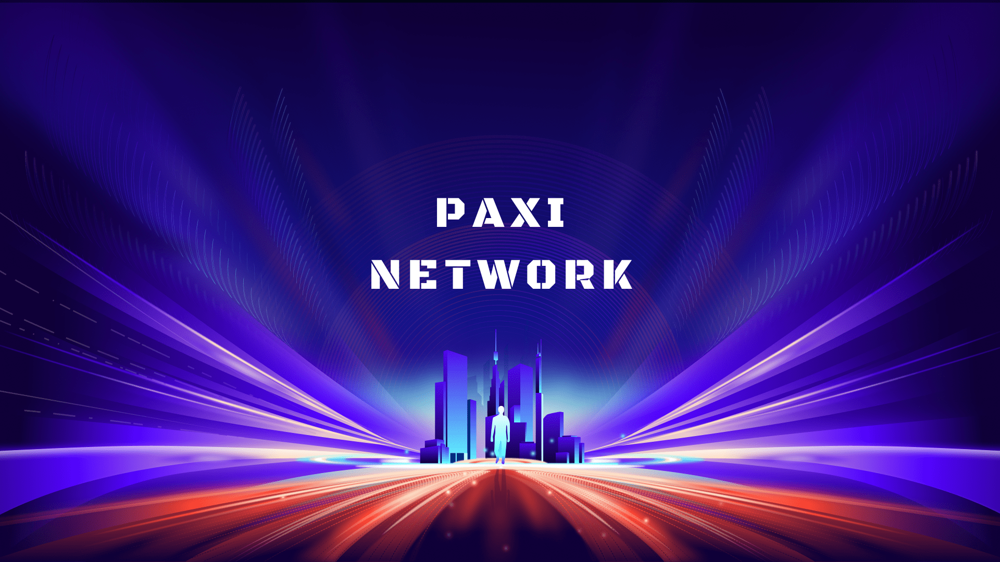

## 🌌 Paxi Blockchain
[](LICENSE)
[](https://goreportcard.com/report/github.com/paxi-web3/paxi)
[](https://github.com/paxi-web3/paxi/releases/tag/v1.0.1)
[](https://github.com/cosmos/cosmos-sdk/releases/tag/v0.53.0)
[](https://github.com/cometbft/cometbft/releases/tag/v0.38.17)
[](https://github.com/CosmWasm/wasmd/releases/tag/v0.55.0)




**Paxi** is a next-generation blockchain built for simplicity, speed, and radical decentralization.

Founded on the principle that *less is more*, Paxi is designed to strip away unnecessary complexity and deliver a clean, efficient, and developer-friendly experience. Every part of the system is purpose-driven — from its modular [Cosmos SDK](https://docs.cosmos.network/v0.53/learn/intro/overview) architecture to its blazing-fast [CometBFT](https://docs.cometbft.com/v0.38/) consensus engine — enabling a blockchain network that is both powerful and beautifully minimal. 

Paxi also supports **smart contracts** via [CosmWasm](https://docs.cosmwasm.com) — a secure and powerful smart contract platform based on WebAssembly (Wasm). Contracts are written in **Rust**, giving developers strong type safety, high performance, and access to a rich ecosystem of tooling.

**Built upon deep optimizations of the Cosmos SDK and CometBFT**, Paxi achieves enhanced performance and security, making it an ideal foundation for scalable and resilient blockchain applications.

**Paxi lowers the barrier to participation**, allowing anyone to become a validator — not just those with deep pockets. This ensures a more inclusive and decentralized network, where governance and consensus are open to all.

Powered by **Go**, Paxi delivers high performance, fast development cycles, and easy onboarding for technical contributors. Whether you're building DeFi protocols, Web3 apps, or next-gen games, Paxi gives you a solid, secure, and intuitive platform to build on.

> **Paxi is not trying to do everything — just everything that matters.**

---

### Core Values

- **Minimal but complete** system architecture — no bloat, just the essentials
- **Fast** – Optimized consensus and state execution, supporting >4,000 TPS
- **Secure** – Proven Tendermint-based BFT consensus with enhanced validator safety
- **Simple is beautiful** – Intuitive module system, CLI & GUI interfaces, developer-friendly SDK
- **Developer-first** — with future IDE and low-code support

### Key Features

- **Smart Contract Support** – Deploy custom logic using Wasm (or native modules)
- **Open Participation** – Anyone can run a node, low entry barrier for validators
- **On-chain Governance & DAO Ready** – Built-in support for decentralized proposals, voting, and community coordination
- **Truly Decentralized** – Designed to maximize validator distribution and community sovereignty
- **Ideal for DeFi & GameFi** – High performance and developer freedom make Paxi a perfect foundation for next-gen apps

Paxi is not just a Cosmos-based chain — it's an **evolution** of the Cosmos model, bringing deeper performance optimizations and a smoother path to sovereignty for any project.

## Documentation

- [Cosmos SDK Documentation](https://docs.cosmos.network/v0.53/learn/intro/overview)
- [CometBFT Documentation](https://docs.cometbft.com/v0.38/)
- [CosmWasm Documentation](https://cosmwasm.cosmos.network/)


## Structure
```mermaid
graph TD
  A[Paxi Blockchain] --> B[Cosmos SDK]
  A --> C[CometBFT]
  A --> D[CosmWasm]
  A --> E[Paxi Custom Modules]
  D --> F[PRC-20 Token]
  D --> G[PRC-721 NFT]
  D --> H[Other Contracts]
  ```


## Linux Native Install for Developers
```bash
curl -sL https://raw.githubusercontent.com/paxi-web3/paxi/scripts/developer_install.sh | bash
```

## Launch Your Own PAXI Mainnet Node in Minutes

### 🐧 Linux Native Install for Mainnet
```bash
curl -sL https://raw.githubusercontent.com/paxi-web3/paxi/scripts/install.sh | bash
```

### 🐳 Docker Install for Mainnet
```bash
curl -sL https://raw.githubusercontent.com/paxi-web3/paxi/scripts/docker_install.sh | bash
```

## Whitepaper

- [English Whitepaper ](docs/whitepaper.md)
- [中文白皮書 ](docs/whitepaper_zh.md)


## Official Website

👉 [https://x.com/paxiweb3](https://x.com/paxiweb3)

## License

MIT © 2025 Paxi Team

